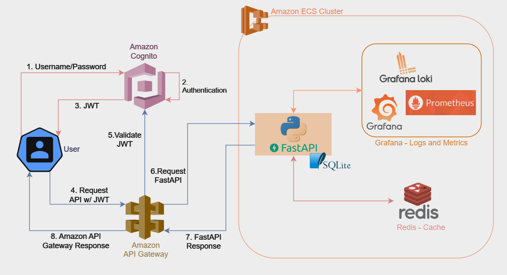

# Currency Converter API

Este projeto consiste em uma API REST construída em Python utilizando o framework FastAPI. A API oferece dois endpoints principais: um para realizar a conversão entre duas moedas e outro para listar todas as operações de conversão realizadas, associadas a um `user_id` especificado no primeiro endpoint.

## Tecnologias Utilizadas

Foi optado pelo framework **[FastAPI](https://fastapi.tiangolo.com/)** devido à sua otimização para construção de APIs REST em Python, incluindo recursos de documentação automáticos como **[Swagger](https://swagger.io/)** e **[Redoc](https://redocly.github.io/redoc/)**. Para aumentar a velocidade e resiliência, foi feito o uso do serviço de cache **[Redis](https://redis.io/)**, a fim de minimizar a necessidade de repetidos requests HTTP a serviços externos.

A qualidade do código é garantida por ferramentas como **[.editorconfig](https://editorconfig.org/)** e o linter **[Flake8](https://flake8.pycqa.org/en/latest/)**. Adotou-se também as práticas de **[Conventional Commits](https://www.conventionalcommits.org/en/v1.0.0/#summary)**, que auxiliam a manter a organização, legibilidade e manutenibilidade do repositório.

Com relação a Logs, foi empregado o uso do Loki com o Grafana, que atendem muito bem a solução proposta.

## Sugestões Futuras

### Arquitetura de Software
Como ambiente de execução em cloud, seria um bom approach o uso do [Amazon ECS](https://aws.amazon.com/pt/ecs/) ou, para mais controle, [Amazon EKS](https://aws.amazon.com/pt/eks/). Em termos de *observability*, adicionar o [Prometheus](https://prometheus.io/) para métricas também seria uma boa escolha. Com respeito aos fluxos de autenticação/autorização, empregar o uso do [Amazon Cognito](https://aws.amazon.com/pt/cognito/) que pode exercer essa função juntamente com o uso do [Amazon API Gateway](https://aws.amazon.com/pt/api-gateway/) seria uma decisão considerável. Embora um banco de dados SQLite seja suficiente para este projeto de demonstração, alternativas como [DynamoDB](https://aws.amazon.com/pt/dynamodb/) ou [MongoDB](https://www.mongodb.com/) garantem segurança e podem oferecer outras vantagens como desempenho superior e organização, por exemplo.
A imagem a seguir oferece uma representação das sugestões colocadas no parágrafo anterior.

### Codificação e Fluxo de Entrega
Com relação a CI/CD, a adição de fluxos de verificação de cobertura de código com ferramentas como [CodeCov](https://about.codecov.io/) e se possível o uso do [SonarQUBE](https://www.sonarsource.com/products/sonarqube/) para análise geral do código, auxiliando na detecção de problemas de desenvolvimento como code smells, segurança e/ou bugs, seria excelente.

## Instruções para Execução

### On-line
1. Acesse https://currency-converter-api-victor-soares-4de6f54a.koyeb.app/api/docs para consultar a documentação Swagger ou https://currency-converter-api-victor-soares-4de6f54a.koyeb.app/api/redoc para a documentação Redoc;
2. Acesse https://currency-converter-api-victor-soares-4de6f54a.koyeb.app/grafana com o login `admin` e senha `admin` para ver os logs da aplicação no Grafana (Login > Explore, no painel lateral esquerdo)

### Local (via *docker-compose.yaml*)
1. Clone o projeto para sua máquina;
2. Verifique as variáveis de ambiente do arquivo `docker-compose.yaml`;
3. Execute o comando `docker-compose up` na pasta raiz do projeto e aguarde a finalização do processo;
4. Acesse `http://localhost/api/docs` para visualizar a interface do Swagger com as documentações dos endpoints um também um cliente HTTP para  teste ou `http://localhost:8000/redoc` para uma visualização alternativa com as documentações oferecidas pelo Redoc;
5. Em `http://localhost/grafana` é possível ter acesso aos logs da aplicação.

---
Observações Gerais: Por questões de praticidade, simplicidade e custos, foi escolhido a cloud da [Koyeb](https://www.koyeb.com/), que atende perfeitamente ao intuito de demonstrar o funcionamento da aplicação. A mesma está integrada diretamente com o github, de forma que, ao atualizar o código da Master, um deploy é feito automaticamente mediante as configurações realizadas na plataforma [CD]. Sobre CI, há um pipeline em `/.github/workflows/ci.yml` que realiza todo o processo de *build*, *lint* e testes (unidade e integração).
